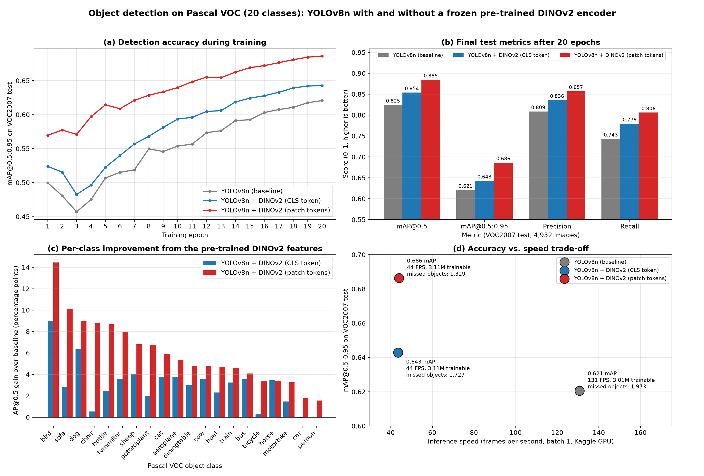

# YOLOv8 + DINOv2: Object Detection Preceded by a Pre-trained Model (Pascal VOC)

A frozen, self-supervised **DINOv2 ViT-S/14** encoder reads the raw image. Its features are injected into the deepest (P5) feature map of a **YOLOv8n** detector. Everything is trained and evaluated on **Pascal VOC 2007+2012** (20 classes).

**Full report:** [report/REPORT.md](report/REPORT.md) (PDF: [report/REPORT.pdf](report/REPORT.pdf))

## Results (VOC2007 test, 4,952 images)

| Model | mAP@0.5 | mAP@0.5:0.95 | Recall | Missed objects | Trainable params | FPS (GPU, batch 1) |
|---|---|---|---|---|---|---|
| YOLOv8n (baseline) | 0.825 | 0.621 | 0.743 | 1,973 | 3.01M | 131 |
| + DINOv2 CLS (reference design) | 0.854 | 0.643 | 0.780 | 1,727 | 3.11M | 44 |
| **+ DINOv2 patch tokens** | **0.885** | **0.686** | **0.806** | **1,329** | 3.11M | 44 |

- With DINOv2's patch tokens, mAP@0.5:0.95 rises by **+6.6 points**, accuracy improves on all 20 classes, and 33% fewer objects are missed.
- Only about 0.1M parameters are added for training (a zero-initialised 1×1 projection). The 22M-parameter DINOv2 encoder stays frozen.



## Repository structure

```
dino_yolo.py            DINOv2 context module, SPPF+DINO fusion layer, YOLODinoModel, DinoDetectionTrainer
train.py                train one variant: baseline | dino-cls | dino-patch (supports --resume)
evaluate.py             mAP, per-class AP, TP/FP/FN analysis, params/FLOPs/latency, plots, qualitative figures
dino_analysis.py        DINOv2 utility without detection: k-NN probe, patch-feature PCA, retrieval
run_all.sh              train all variants + evaluate + analysis
kaggle_voc_dino.ipynb   end-to-end runner for a Kaggle GPU notebook
requirements.txt
report/                 report (Markdown + PDF) and figures
kaggle_output/
  results/              metrics, per-class AP, k-NN probe, figures from the Kaggle run
  results_patch_local/  baseline vs dino-patch re-evaluation and qualitative comparisons
  runs/detect/<run>/    training curves (results.csv), hyper-parameters (args.yaml), Ultralytics plots
```

Trained weights (`*.pt`) are not committed because of their size. `kaggle_output/results/dino_patch_pca.png` was regenerated locally after fixing the foreground-mask computation in `dino_analysis.py`.

## Reproduce

```bash
pip install -r requirements.txt
python train.py --variant baseline            # add --device 0 --cache ram on a CUDA GPU
python train.py --variant dino-cls
python train.py --variant dino-patch
python evaluate.py --runs baseline dino-cls dino-patch
python dino_analysis.py
```

The Pascal VOC dataset (~3 GB), YOLOv8n COCO weights and DINOv2 weights are downloaded automatically on first use. On Kaggle, upload the `.py` files and `requirements.txt` as a dataset, import `kaggle_voc_dino.ipynb`, enable GPU and Internet, and run it.

## References

- Oquab et al., *DINOv2: Learning Robust Visual Features without Supervision*, TMLR 2024.
- Jocher et al., *Ultralytics YOLOv8*, 2023.
- Everingham et al., *The Pascal Visual Object Classes (VOC) Challenge*, IJCV 2010.
- I3D Lab, IISc, [AI resources for Design & Manufacturing](https://cambum.net/I3DLab/AI4DM.htm).
