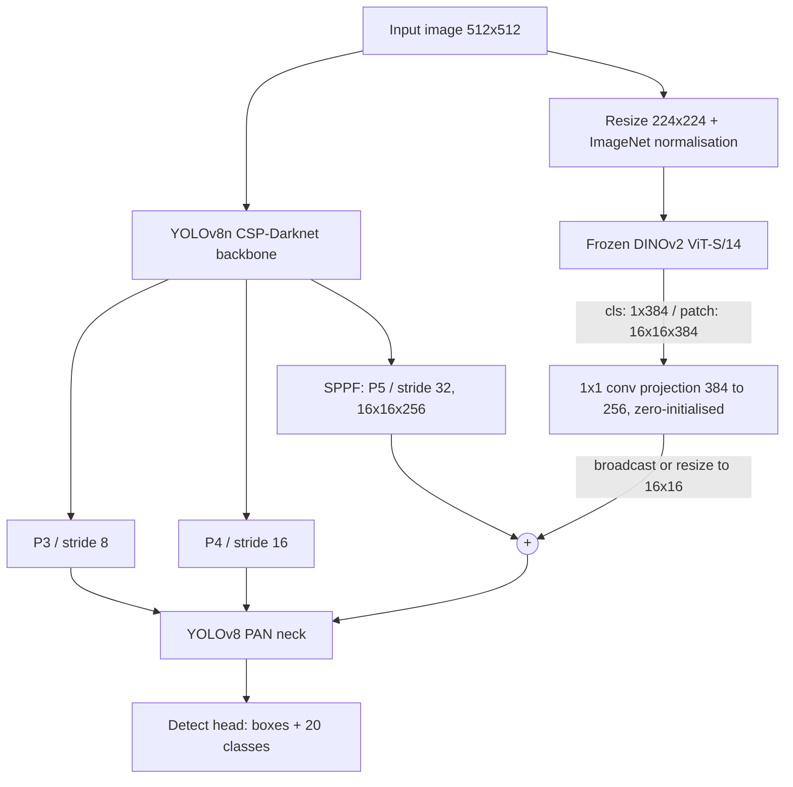
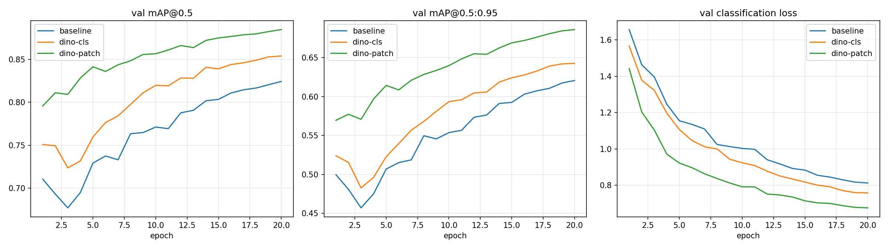
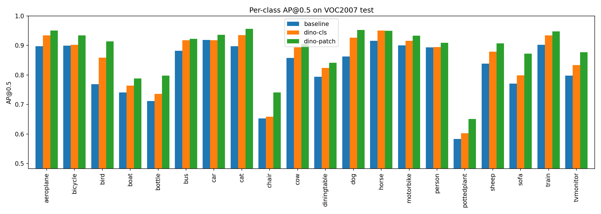
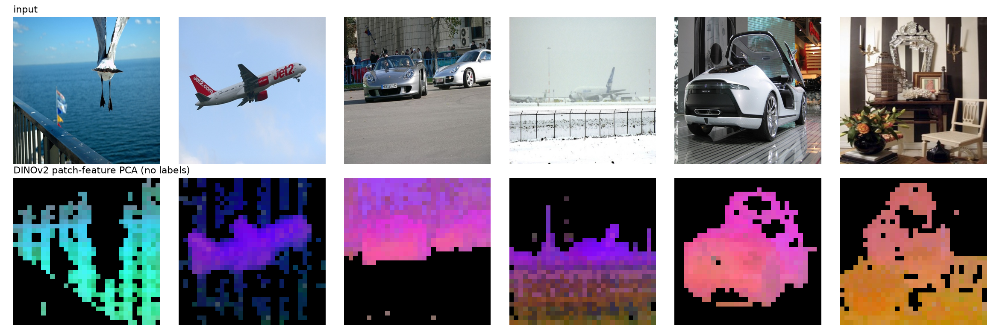
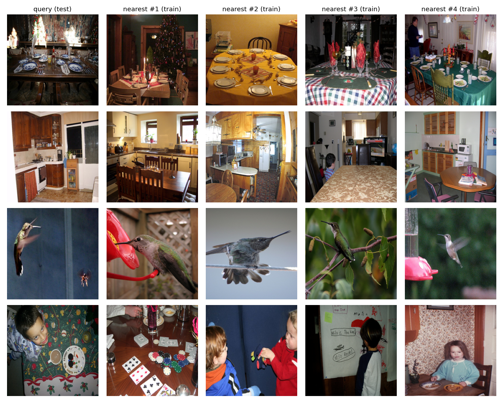
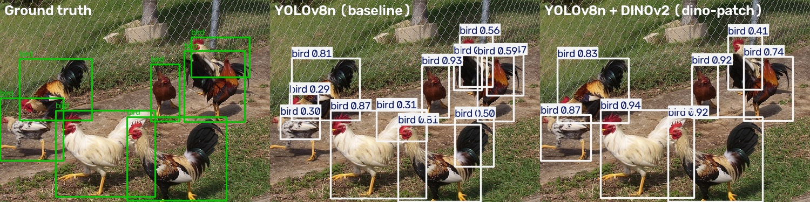
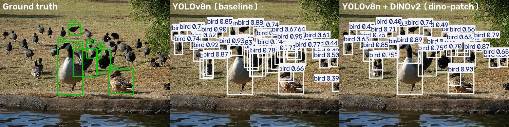
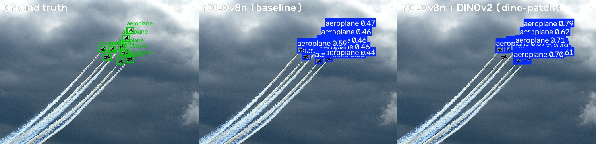

# Object Detection Preceded by a Pre-trained Foundation Model: YOLOv8 + DINOv2 on Pascal VOC

**Author:** shravanachar-iisc (shravanachar@iisc.ac.in)

**Course:** Intelligent User Interfaces, IISc (4th semester)

**Code:** https://github.com/shravanachar-iisc/yolov8-dinov2-voc-detection

**Reference design:** "YOLOv8 + DINOv2: Injecting Global Semantics for Better Detection", I3D Lab, [AI resources for Design & Manufacturing](https://cambum.net/I3DLab/AI4DM.htm)

---

## 1. Objective

We build an object detector that is **preceded by a pre-trained model**, use a **standard dataset**, and check whether the pre-trained model actually helps and why.

- **Detector:** YOLOv8n, a fast single-stage detector.
- **Pre-trained model:** DINOv2 ViT-S/14, a self-supervised Vision Transformer. It stays frozen and reads the raw image *before* YOLO's detection head. Its features are injected into YOLO's deepest feature map.
- **Dataset:** Pascal VOC 2007 + 2012 (20 classes).

We compare three models that are identical except for the DINOv2 branch:

| Model | Description |
|---|---|
| `baseline` | YOLOv8n |
| `dino-cls` | YOLOv8n + DINOv2 **global (CLS) embedding**, broadcast over the P5 feature map. This is the course reference design. |
| `dino-patch` | YOLOv8n + DINOv2 **patch-token grid**, resized to the P5 feature map. This is our spatially-aware extension. |

## 2. Dataset: Pascal VOC

Pascal VOC [3] is a standard benchmark for object detection. We use the usual split:

| Split | Source | Images |
|---|---|---|
| Train | VOC2007 trainval + VOC2012 trainval | 16,551 |
| Test | VOC2007 test | 4,952 |

- **20 classes:** aeroplane, bicycle, bird, boat, bottle, bus, car, cat, chair, cow, diningtable, dog, horse, motorbike, person, pottedplant, sheep, sofa, train, tvmonitor.
- **Annotations:** the original XML boxes were converted to YOLO format (`class x_center y_center width height`, normalised) by the Ultralytics `VOC.yaml` loader.
- **Why VOC:** it is a widely used public benchmark with a fixed test set. It is also small enough to train three models inside a single Kaggle GPU session.

## 3. The pre-trained models and their utility

Two different pre-trained models are used, and they play different roles.

### 3.1 YOLOv8n pre-trained on COCO (initialisation)

- All three models start from the official `yolov8n.pt` weights, trained with labels on COCO (80 classes).
- This is standard transfer learning. The backbone already recognises edges, textures and object parts, so 20 epochs on VOC are enough.
- It is the same for all three models, so it does not explain any difference between them.

### 3.2 DINOv2 ViT-S/14 (the pre-trained model that precedes the detector)

**What it is.**
- DINOv2 [1] is a Vision Transformer trained by Meta with **self-supervised learning** on LVD-142M, a curated set of 142 million images. It **never saw a single label**.
- It learns through self-distillation: a student network must match a teacher network's output for different crops of the same image, plus a masked-patch objective.
- We use the smallest version, ViT-S/14: 22.1M parameters, 14×14-pixel patches, 384-dimensional features.
- For a 224×224 input it outputs:
  - **one global CLS embedding**, a summary of the whole image;
  - **a 16×16 grid of patch embeddings**, one per 14×14 region.

**Why it is useful for detection.**
1. **Semantics without labels.** YOLO only learns from bounding-box labels, so it learns *the textures of the examples it has seen*. DINOv2 was trained on about 1,000 times more images than COCO, so its features describe *what* things are (shape, parts, category) in a way that transfers across datasets.
2. **Context.** The global embedding summarises the whole scene ("a farmyard", "a living room"). This tells the detector which classes are plausible.
3. **Label efficiency and cheap adaptation.** DINOv2 stays frozen, so the detector gains this knowledge with only **~0.1M new trainable parameters** and no extra labelled data.

**Evidence, measured without any detection training (§6.5):**
- A frozen DINOv2 embedding predicts which VOC classes are in an image with **0.890 mAP**, using only nearest neighbours. YOLOv8n's own COCO-trained global feature reaches only **0.817**.
- A PCA of its patch features separates objects from background and groups object parts, again without labels.

## 4. Method

### 4.1 Architecture



Let $F \in \mathbb{R}^{256\times16\times16}$ be the output of YOLO's SPPF layer (P5, stride 32) for a 512×512 input. Let $\phi(I)$ be the frozen DINOv2 feature. The fused feature map is:

$$
F' = F + W * \Phi(I), \qquad
\Phi(I) =
\begin{cases}
\text{broadcast}_{16\times16}\big(\phi_{\text{CLS}}(I)\big) & \texttt{dino-cls}\\[2pt]
\text{resize}_{16\times16}\big(\phi_{\text{patch}}(I)\big) & \texttt{dino-patch}
\end{cases}
$$

- $W$ is a learned $1\times1$ convolution (384 → 256 channels, 98,560 parameters).
- A 224-pixel DINOv2 input gives a $16\times16$ patch grid. This matches the P5 grid of a 512-pixel YOLO input exactly, so the resize in the patch variant is the identity.

**Design choices:**
- **Residual fusion with a zero-initialised projection.**
  - The reference design concatenates SPPF and DINO features and then applies a $1\times1$ convolution. Our residual form $F + W\Phi$ is exactly that concat+conv with the YOLO half fixed to the identity.
  - Initialising $W = 0$ (the "zero-convolution" idea from ControlNet [5]) means that at step 0 the fused model is **exactly** the COCO-pretrained YOLOv8n. We verified this: the maximum output difference is 0.0.
  - Training then decides how much DINOv2 information to use. After training, the projection weights are clearly non-zero (mean |W| = 0.0066 for cls, 0.0091 for patch), so the model did learn to use DINOv2.
- **DINOv2 is frozen.**
  - It runs under `torch.no_grad()`, stays in eval mode, and is excluded from the optimiser through Ultralytics' `freeze` list.
  - The DINOv2 weights in both final checkpoints are **bit-identical** to the released weights.
- **Injection at P5 only.** P5 has the largest receptive field and holds the most semantic information. From there the PAN neck passes the injected information down to the P4 and P3 detection scales.

### 4.2 Implementation

| File | Purpose |
|---|---|
| `dino_yolo.py` | `DINOv2Context` (frozen encoder + projection), `SPPFDino` (SPPF + context, which keeps the original SPPF parameter names so COCO weights load unchanged), `YOLODinoModel` (a `DetectionModel` subclass that passes the raw image to the fused layer), `DinoDetectionTrainer` |
| `train.py` | Trains one variant: `--variant {baseline,dino-cls,dino-patch}`. Supports `--resume`. |
| `evaluate.py` | VOC2007-test mAP, per-class AP, TP/FP/FN error analysis, parameters, FLOPs, latency, plots, qualitative comparisons |
| `dino_analysis.py` | Checks DINOv2's usefulness without detection: k-NN probe, patch-feature PCA, image retrieval |
| `kaggle_voc_dino.ipynb` | End-to-end Kaggle runner |

The Ultralytics library is used unmodified. The DINOv2 branch is added by subclassing, not by editing library source.

## 5. Experimental setup

All three runs use identical settings. Only the DINOv2 branch differs.

| Setting | Value |
|---|---|
| Initialisation | COCO-pretrained `yolov8n.pt` |
| Epochs / image size / batch | 20 / 512 / 32 |
| Optimiser | AdamW, lr 4.17e-4 (chosen by Ultralytics "auto"), 3 warm-up epochs, standard YOLO augmentation (mosaic, HSV, flips) |
| DINOv2 | `facebook/dinov2-small`, 224×224 input, frozen |
| Precision | Mixed precision (AMP) |
| Seed | 0 |
| Hardware | One NVIDIA GPU on Kaggle. Training time: baseline 0.49 h, each DINOv2 variant 0.62 h. |
| Test set | VOC2007 test, 4,952 images, 12,032 objects |

## 6. Results

### 6.1 Main results (VOC2007 test)

| Model | mAP@0.5 | mAP@0.5:0.95 | Precision | Recall |
|---|---|---|---|---|
| YOLOv8n (baseline) | 0.8245 | 0.6206 | 0.809 | 0.743 |
| + DINOv2 CLS (`dino-cls`) | 0.8540 (**+3.0**) | 0.6429 (**+2.2**) | 0.836 | 0.780 |
| + DINOv2 patch (`dino-patch`) | **0.8846 (+6.0)** | **0.6864 (+6.6)** | **0.857** | **0.806** |

Improvements are in absolute mAP points.

We re-evaluated the baseline and `dino-patch` checkpoints on a second machine (Apple M4 Pro). The results matched within 0.0001 mAP, with identical TP/FP/FN counts.

### 6.2 Training dynamics



- **The DINOv2 variants lead from the first epoch.** mAP@0.5:0.95 after epoch 1 was 0.500 (baseline), 0.524 (cls) and **0.570 (patch)**.
- The patch model's lead is +7.0 points after epoch 1, +8.6 at epoch 10 and +6.6 at epoch 20.
- All three runs dip in epochs 2–3 while the learning rate warms up, disturbing the COCO-pretrained weights. All recover over the following epochs.
- **All three were still improving at epoch 20**: every run's best epoch was its last. Longer training would raise all three curves.

### 6.3 Error analysis (confidence threshold 0.25, IoU 0.5)

| Model | True positives | False positives | Missed objects (FN) | Validation box loss | Validation class loss |
|---|---|---|---|---|---|
| Baseline | 10,059 | 4,743 | 1,973 | 0.899 | 0.812 |
| `dino-cls` | 10,305 | 4,826 (+2%) | 1,727 (**−12%**) | 0.899 (±0) | 0.757 (**−7%**) |
| `dino-patch` | 10,703 | 4,603 (−3%) | 1,329 (**−33%**) | 0.840 (**−7%**) | 0.675 (**−17%**) |

Image by image, compared with the baseline:
- `dino-cls` reduces errors (FP + FN) on 1,184 images, increases them on 945, and leaves 2,823 unchanged. Total errors fall from 6,716 to 6,553.
- `dino-patch` reduces errors on **1,370** images, increases them on 859, and leaves 2,723 unchanged. Total errors fall from 6,716 to **5,932 (−11.7%)**.

### 6.4 Per-class results



AP@0.5 gain over the baseline, in points:

| Class | Baseline AP | cls gain | patch gain |
|---|---|---|---|
| bird | 0.769 | +9.0 | **+14.4** |
| sofa | 0.771 | +2.8 | **+10.1** |
| dog | 0.863 | +6.4 | +9.0 |
| chair | 0.653 | +0.5 | +8.8 |
| bottle | 0.712 | +2.5 | +8.7 |
| tvmonitor | 0.798 | +3.6 | +8.0 |
| sheep | 0.839 | +4.1 | +6.8 |
| pottedplant | 0.583 | +2.0 | +6.7 |
| cat | 0.898 | +3.7 | +5.9 |
| aeroplane | 0.898 | +3.7 | +5.4 |
| diningtable | 0.794 | +3.0 | +4.8 |
| cow | 0.858 | +3.6 | +4.8 |
| boat | 0.741 | +2.3 | +4.7 |
| train | 0.902 | +3.2 | +4.6 |
| bus | 0.882 | +3.6 | +4.1 |
| horse | 0.916 | +3.4 | +3.4 |
| bicycle | 0.900 | +0.3 | +3.4 |
| motorbike | 0.901 | +1.5 | +3.3 |
| car | 0.919 | −0.1 | +1.8 |
| person | 0.894 | +0.0 | +1.6 |

- `dino-patch` improves **all 20 classes**.
- The largest gains are on **animals** (bird, dog, sheep, cat) and **cluttered indoor objects** (sofa, chair, bottle, tvmonitor, pottedplant).
- The smallest gains are on **person** and **car**. These are the most common COCO classes, where YOLO's COCO pre-training is already strong.

### 6.5 Utility of the pre-trained model, measured directly

**(a) k-NN probe: "which classes are in this image?"**
- Each test image is embedded with a frozen global feature. Its class labels are then predicted from its 20 nearest neighbours among 4,000 labelled training images, using the DINO k-NN protocol [2].
- No training is involved, so this measures only the quality of the pre-trained representation.

| Global embedding | Dimensions | Labels seen during pre-training | Multi-label mAP |
|---|---|---|---|
| YOLOv8n SPPF/P5, average-pooled | 256 | COCO boxes (80 classes, including all 20 VOC classes) | 0.817 |
| **DINOv2 ViT-S/14 CLS** | 384 | **none** | **0.890** |

- DINOv2 never saw a label, yet it beats a detector trained on labels for a superset of VOC's classes by **+7.3 mAP**.
- Its largest advantages are dog (+18.6), cow (+18.5), bottle (+18.1), sheep (+16.8) and bird (+12.1).
- YOLO's feature is better only for person, chair and pottedplant.

**(b) The probe predicts where fusion helps.**
- Across the 20 classes, we measured how the per-class k-NN advantage of DINOv2 relates to each variant's per-class detection gain (Spearman rank correlation):

| | ρ with DINOv2's k-NN advantage | ρ with baseline AP |
|---|---|---|
| `dino-cls` gain | **+0.63** | −0.06 |
| `dino-patch` gain | +0.30 | **−0.70** |

- `dino-cls` improves exactly the classes where DINOv2's *global semantics* are better than YOLO's (e.g. bird, dog, sheep, cow). It does not particularly help classes that are simply hard.
- `dino-patch` helps most where the baseline is *weakest* (ρ = −0.70). These are small, occluded or cluttered-scene classes such as chair, bottle, pottedplant and sofa, which need spatially-resolved features rather than a scene summary.

**(c) Patch-feature PCA (no labels).**



- For each image we take the first principal component of its 32×32 patch tokens (at a 448-pixel input) as a foreground mask. The remaining components are coloured with one shared PCA.
- The aeroplanes and the car are cleanly separated from sky and road, and object parts receive consistent colours.
- This is the kind of object-level structure the detector can use.
- The heuristic is weaker when the object touches the image border (the gull, the street scene), because the border is assumed to be background.

**(d) Retrieval.** Nearest neighbours of test images in DINOv2-CLS space are semantically coherent: dining tables with dining tables, kitchens with kitchens, hummingbirds with hummingbirds, children with children.



### 6.6 Qualitative comparison (baseline vs `dino-patch`)

Each panel shows ground truth, then baseline, then `dino-patch`. These are the extreme cases selected by the per-image error difference, so they illustrate behaviour rather than average performance.

**Improvement: overlapping roosters.**
- The baseline produces fragmented, duplicate, low-confidence boxes (0.29–0.59).
- `dino-patch` gives one box per bird with confidence 0.83–0.94.



**An annotation artifact: bird flock.**
- VOC labels only a few of the birds in this flock.
- Many of the baseline's "false positives" are real, unlabelled birds. `dino-patch` is more conservative, which the metric rewards.
- So some measured false-positive changes reflect incomplete ground truth, not only model quality.



**Failure: dense tiny aeroplanes.**
- `dino-patch` is more confident (0.6–0.8 vs 0.44–0.59) but merges or misses some of the tiny aircraft.
- Each DINOv2 patch covers 32×32 input pixels, larger than these objects, so the injected context blurs neighbouring instances.



### 6.7 Cost

| Model | Total params | Trainable params | GFLOPs @512 | Latency, batch 1, Kaggle GPU | Latency, batch 1, Apple M4 Pro | Checkpoint size |
|---|---|---|---|---|---|---|
| Baseline | 3.01M | 3.01M | 5.2 | 7.6 ms (131 FPS) | 7.9 ms (127 FPS) | 6 MB |
| `dino-cls` | 25.2M | 3.11M | 17.4 | 23.0 ms (44 FPS) | – | 51 MB |
| `dino-patch` | 25.2M | 3.11M | 17.5 | 22.8 ms (44 FPS) | 16.2 ms (62 FPS) | 51 MB |

- The DINOv2 encoder accounts for most of the extra compute (about 3.4× FLOPs, 2–3× latency).
- The fused model still runs well above real-time on both GPUs.
- The cls and patch variants cost the same, so the patch variant's extra +4.4 mAP comes for free.

## 7. Discussion

1. **The pre-trained model clearly helps.** Adding a frozen DINOv2 improves mAP@0.5:0.95 by +2.2 (reference cls design) and +6.6 (patch design), with only ~0.1M extra trainable parameters. The gain cannot come from extra trainable capacity. It comes from *knowledge* DINOv2 acquired during self-supervised pre-training on 142M unlabelled images.
2. **"What" vs "where".**
   - The global CLS embedding is the same at every spatial location, so it can only shift class scores according to scene content. Classification loss drops by 7% while box loss is unchanged.
   - Patch tokens are spatially resolved, so they help both recognise *and* localise objects: box loss −7%, classification loss −17%, missed objects −33%.
   - The reference design's claim that global context mainly *eliminates false positives* is not supported here. False positives stayed within ±3%. The benefit shows up as **higher recall and more confident, better-calibrated classification**.
3. **Utility is predictable.** The class-level k-NN probe, which uses no detection training, predicts where the global-context model gains (ρ = 0.63). A cheap representation probe can therefore tell us in advance whether a foundation model will help a detector on a new dataset.
4. **Faster convergence.** The fused models are 2.4–7.0 points ahead after a single epoch. This matters in data- or compute-limited settings, such as the design-and-manufacturing case studies the reference page targets.

## 8. Limitations and future work

- **Single seed.** There are no error bars. The +6.6 mAP gain is large and consistent across all 20 classes, so it is unlikely to be seed noise. Gains of 1–2 points (e.g. `dino-cls` on individual classes) should be treated with caution.
- **Short schedule.** All models were still improving at 20 epochs. The gap may narrow with longer training.
- **Not compute-matched.** The fused model uses about 3.4× the FLOPs. A fairer baseline would be a larger YOLO of similar cost, such as YOLOv8s (about 28.6 GFLOPs at 640).
- **Low-data regime not tested.** Foundation-model features are expected to help most when labels are scarce. A run with `--fraction 0.1` would test this directly.
- **Coarse injection.** DINOv2 enters only at P5, at 224 pixels. Injecting at P4/P3, using a larger DINOv2 input, or cross-attention fusion could help small objects (see the aeroplanes failure).
- **VOC annotation gaps** (§6.6) add noise to false-positive counts.

## 9. Reproducibility

```bash
pip install -r requirements.txt
python train.py --variant baseline   --device 0 --cache ram
python train.py --variant dino-cls   --device 0 --cache ram
python train.py --variant dino-patch --device 0 --cache ram
python evaluate.py --runs baseline dino-cls dino-patch
python dino_analysis.py
```

Or run `kaggle_voc_dino.ipynb` on Kaggle (GPU, Internet on). Raw outputs of the reported run are in `kaggle_output/`.

## References

1. M. Oquab et al., "DINOv2: Learning Robust Visual Features without Supervision," *TMLR*, 2024 (arXiv:2304.07193).
2. M. Caron et al., "Emerging Properties in Self-Supervised Vision Transformers," *ICCV*, 2021.
3. M. Everingham et al., "The Pascal Visual Object Classes (VOC) Challenge," *IJCV*, 88(2), 2010.
4. G. Jocher, A. Chaurasia, J. Qiu, "Ultralytics YOLOv8," 2023. https://github.com/ultralytics/ultralytics
5. L. Zhang, A. Rao, M. Agrawala, "Adding Conditional Control to Text-to-Image Diffusion Models" (ControlNet), *ICCV*, 2023.
6. A. Dosovitskiy et al., "An Image is Worth 16x16 Words: Transformers for Image Recognition at Scale," *ICLR*, 2021.
7. I3D Lab, IISc, "AI resources for Design & Manufacturing: YOLOv8 + DINOv2," https://cambum.net/I3DLab/AI4DM.htm
